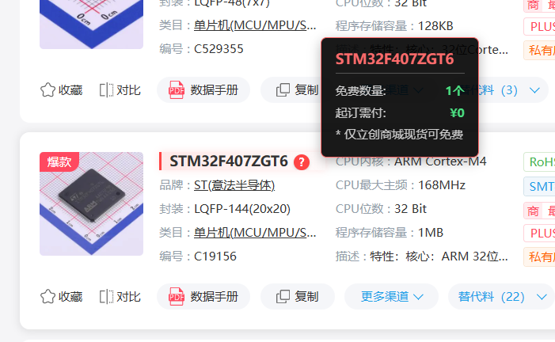
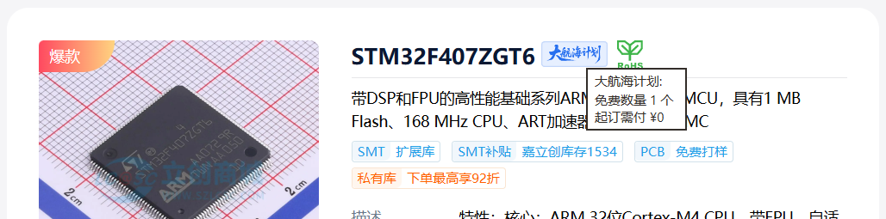

# 立创商城大航海计划助手

## [安装脚本](https://greasyfork.org/scripts/570934) · [物料清单](LIST.md)

## 介绍

本脚本用于辅助用户使用立创商城大航海计划白嫖物料，主要功能包括：
- 搜索&详情页自动标识可白嫖物料
- 物料详情页添加预备料按钮，允许将物料加入预备料列表
- 大航海计划项目页面添加一键备料按钮，一键将预备料列表中的物料加入项目

| 自动标识 | 预备料 | 一键备料 |
| :---: | :---: | :---: |
|   |  |  |

## 使用说明

1. 安装脚本后，访问立创商城搜索物料或进入物料详情页，脚本会自动标识可白嫖的物料；
2. 在物料详情页，点击“大航海预备料”按钮将物料加入预备料列表；
3. 进入大航海计划项目页面，点击“一键备料”按钮将预备料列表中的物料加入项目。

## 脚本菜单

- **设置数据源**：设置大航海物料数据源，默认为本仓库中的 `sea_patrol_project.json` 文件，用户也可以选择其他数据源；
- **更新数据**：从数据源更新大航海物料数据；
- **管理预备料**：查看和管理预备料列表中的物料；
- **清除缓存**：清除脚本缓存的数据。

## 开源许可

本项目使用 Apache License 2.0 许可证，详情请参阅 [LICENSE](LICENSE) 文件。

本项目使用 Github Copilot 辅助开发。
